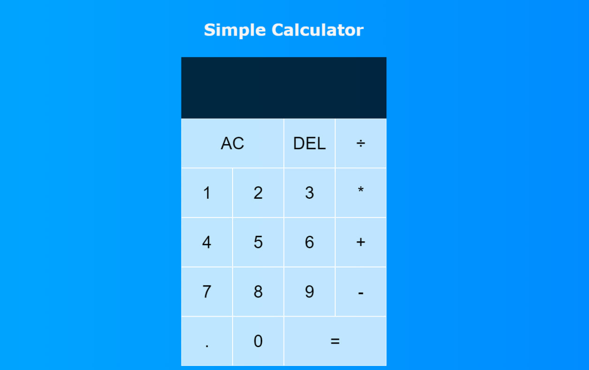

# Simple Calculator

A simple, user-friendly calculator application built with React. It supports standard arithmetic operations such as addition, subtraction, multiplication, and division. The user interface is straightforward and user-friendly, featuring buttons for digits, operations, and controls like clear (AC), delete (DEL), and evaluate (=).
<br>
<br>
<p align="center">
  <a href="https://github.com/Pavith19/Scientific-Calculator/">
    
  </a>
</p>
<br>
<p align="center">
  <a href="https://pavithscal.netlify.app/">
    
  </a>
</p>


## Features

- Basic arithmetic operations: addition, subtraction, multiplication, and division.
- Clear all input (AC) and delete the last digit (DEL) functions.
- Supports decimal numbers.
- Automatically limits the number of digits for operands and results to ensure usability.

## Installation

1. Clone the repository:

    ```bash
    git clone https://github.com/your-username/simple-calculator.git
    ```

2. Navigate to the project directory:

    ```bash
    cd simple-calculator
    ```

3. Install the dependencies:

    ```bash
    npm install
    ```

## Usage

1. Start the development server:

    ```bash
    npm start
    ```

2. Open your browser and navigate to `http://localhost:3000` to see the calculator in action.

## Project Structure

- `DigitButton.js`: Component for digit buttons.
- `OperationButton.js`: Component for operation buttons.
- `styles.css`: CSS styles for the calculator.

## 🛠 Skills
React, JavaScript, CSS & HTML

<h3 align="center">Connect with me:</h3>
<p align="center">
  <a href="https://instagram.com/_mr_2001__" target="blank"></a>
  <a href="https://linkedin.com/in/www.linkedin.com/in/pavith-bambaravanage-465300293" target="blank"></a>
  <a href="https://www.hackerrank.com/@pavith_db" target="blank"></a>
  <a href="https://www.leetcode.com/pavith_db" target="blank"></a>
  <a href="mailto:pavithd2020@gmail.com" target="blank"></a>
</p>
